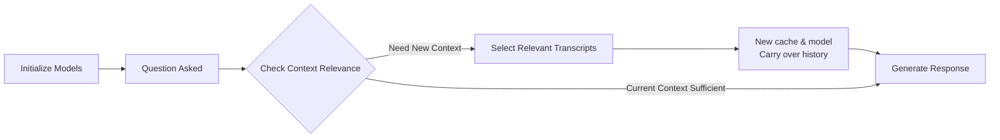

# OLABot Technical Documentation

## Overview
OLABot is a Python-based chatbot designed to interact with Ontario Legislature (Hansard) transcripts. It uses Google's Gemini AI to provide factual responses about legislative proceedings. To scale Gemini's context window from 1 million to 20 million tokens, we developed a method which we call *dynamic caching*.

## Overall Design

The core technical challenge is that the transcripts are quite long, in fact totalling _20 million tokens_. This makes it infeasible to load the entire corpus into memory, even with Gemini's 1 million tokens context window. We also want to optimize for resource usage.

This led us to develop *dynamic caching*. Dynamic caching is a technique that allows the bot to dynamically load and unload transcripts based on the user's question. Sometimes, users may ask a series of questions about the same topic, such that it can be answered with the currently loaded transcripts. However, users may also want to ask a question which would require different transcripts. In dynamic caching, every question is first queried to see if the currently loaded transcripts can answer the question. If yes, then the question is answered. If not, then new transcripts are retrieved and loaded in.

The dynamic caching system has three components:
1. Determine if the current transcripts can answer the question (`_check_context_relevance`)
2. Retrieve and load in new transcripts if necessary (`_select_relevant_transcripts`)
3. Answer the question (`_generate_response`)

To save time and costs, tasks (1) and (2) use Gemini Flash 8B, which we refer to as `retrieval_model`. Also, they use summaries of the transcripts, instead of the full transcripts themselves.

For task (3), we use Gemini Flash, which we refer to as `model`.

The retrieval model simply requires a cache of the transcript summaries, and this does not change. We use Gemini's caching system for this.

The main model, however, requires a cache of the transcripts themselves. This is more expensive, and we want to limit the number of transcripts loaded in to save costs. This is where dynamic caching comes in.

## Program Flow

### Initialization
- Two Gemini models are initialized:
  - `retrieval_model`: Cached with transcript summaries
  - `model`: Started with empty cache

### Question Processing
1. When a question is asked, `_check_context_relevance` uses the retrieval model to determine if current context can answer it

2. If new context needed:
   - Select relevant transcripts using the retrieval model (`_select_relevant_transcripts`)
   - Create new cache and model instance, with carried over history (`_update_current_context`)

3. If current context sufficient:
   - Use existing model and cache

4. Generate response using loaded context (`_generate_response`)



## Initialization

The bot reads a JSON file containing Hansard transcripts. It then processes them for easier searching and retrieval (see `_generate_transcript_summaries`). It also initializes two models: `model` and `retrieval_model`, which are Gemini Flash and Gemini Flash 8B respectively, used for different tasks (note this is easily changeable by modifying some constants).

## Class Attributes

### Constants
- `MAX_TRANSCRIPT_CONTEXT`: Maximum number of transcripts to load at once
- `CACHE_TTL_MINUTES`: Cache time-to-live in minutes
- `RETRIEVAL_MODEL_NAME`: Gemini model name used for tasks (1) and (2)
- `MAIN_MODEL_NAME`: Gemini model name used for task (3)

### Configuration Attributes
- `debug`: Boolean flag for enabling debug output
- `streaming`: Boolean flag for enabling response streaming

### Instance Attributes
- `transcripts`: A dictionary mapping dates to transcripts
- `transcript_topics`: A dictionary mapping dates to lists of discussion topics
- `transcript_speakers`: A dictionary mapping dates to lists of speakers present
- `transcript_bills`: A dictionary mapping dates to lists of bills discussed
- `transcript_summaries`: A dictionary mapping dates to formatted summary strings
- `transcript_condensed`: A condensed string of all available transcripts
- `available_dates`: A list of all dates in the corpus in YYYY-MM-DD format, sorted in descending order
- `earliest_date`: The earliest date in the corpus
- `latest_date`: The latest date in the corpus
- `current_dates`: Currently loaded transcript dates. A list of strings in YYYY-MM-DD format
- `current_context`: Currently loaded transcript content as a string
- `model`: Gemini Flash model
- `retrieval_model`: Gemini Flash 8B model
- `current_context_cache`: Gemini cache for the main model's context
- `transcript_summaries_cache`: Gemini cache for the retrieval model's summaries
- `chat`: Gemini chat object for the main model

## Key Methods

### Transcript Processing

```python
def _generate_transcript_summaries(self) -> tuple[dict, dict, dict, dict]:
```

This function processes the transcripts into four dictionaries:
- `transcript_topics`: Maps dates to lists of discussion topics
- `transcript_speakers`: Maps dates to lists of speakers present
- `transcript_bills`: Maps dates to lists of bills discussed
- `transcript_summaries`: Maps dates to formatted summary strings

The extraction process uses heuristics with string matching, regex, and simple parsing. They are imperfect but work well for our purposes, as we will use Gemini to compare everything.

1. Topic Extraction
   - Examines the first 50 paragraphs of each transcript to find the table of contents
   - Filters out common header elements:
     - "LEGISLATIVE ASSEMBLY" (in English and French)
     - Day names (in English and French)
     - Empty lines
   - Remaining lines are considered topics for that day's session

2. Speaker Identification
   - Looks for lines such that:
     - Start with a title (Mr., Ms., Mrs., Hon., The)
     - Contains a colon
   - Then, splits the line by the colon and takes the first part as the speaker
   - Also, ensure that speaker contains either:
     - Text in parentheses, or
     - Includes a formal title
   - Example valid formats: "Mr. Smith:", "Hon. Jane Doe (Minister of Finance):", "Ms. Johnson (Toronto—Danforth):"
   - Known limitation: May occasionally miss speakers or include false positives

4. Bill Detection
   - Uses regular expressions to find bill references: `Bill\s+\d+[A-Za-z]*`
   - Example matches: "Bill 124" and "Bill 45A"

5. Summary Generation
   - Consolidated string: "DATE -- Speakers: [list] | Topics: [list] | Bills: [list]"

### Context Management

```python
def _check_context_relevance(self, question: str) -> str:
```

Determines if current loaded transcripts can answer a new question by:
1. Analyzing conversation history
2. Checking current transcript summaries
3. Using Gemini to decide if new context is needed

If current context is blank (e.g., first question), it will just return `NEED_NEW_CONTEXT`.

Returns: `USE_CURRENT_CONTEXT` or `NEED_NEW_CONTEXT`

```python
def _update_current_context(self, dates: list[str]):
```

Updates the current transcript context to the given dates and the corresponding transcripts. It creates a new Gemini model and cache, and carries over the conversation history. Related methods: `_create_cached_model` and `_initialize_chat`.

### Transcript Selection

```python
def _select_relevant_transcripts(self, question: str) -> list[str]:
```

Uses Gemini to select the most relevant transcript dates based on:
1. Date filters if specified
2. Speaker mentions
3. Topic relevance
4. Bill discussions

Returns: List of dates of transcripts to load in YYYY-MM-DD format

### Response Generation

```python
def _generate_response(self, question: str) -> str:
```
The main method that generates responses. Uses the current question, recent conversation history, selected transcript content. This uses Gemini's chat API, i.e., `send_message`.

## Other Technical Details

### Dependencies
- `google.generativeai`: Gemini AI interface
- `colorama`: Terminal output formatting
- `python-dotenv`: Environment variable management
- `json`: Transcript data handling
- `datetime`: Date processing
- `re`: Regular expression operations

### Environment Setup
Requires:
1. `.env` file with GEMINI_API_KEY
2. Hansard transcripts in JSON format
3. Python 3.x
4. Required packages installed via pip

### Debug Mode
When enabled (`debug=True`):
- Prints routing decisions
- Shows context selection process
- Displays token usage statistics
