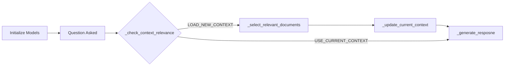

# OLABot Technical Documentation

## Overview
OLABot is a Python-based chatbot designed to interact with documents from the Ontario Legislature, which includes transcripts (Hansard) as well as bills. It uses Google's Gemini AI to provide factual responses about government proceedings. To scale Gemini's context window from 1 million to 20 million tokens, we developed a method which we call *dynamic caching*.

## Usage
```
python olabot.py
```

To enable debug mode,
```
python olabot.py --debug
```

By default, streaming is enabled. To disable it,
```
python olabot.py --no-streaming
```

## Overall Design

The core technical challenge is that the documents are quite long, in fact totalling _20 million tokens_. This makes it infeasible to load the entire corpus into memory, even with Gemini's 1 million tokens context window. We also want to optimize for resource usage.

This led us to develop *dynamic caching*. Dynamic caching is a technique that allows the bot to dynamically load and unload documents based on the user's question. Sometimes, users may ask a series of questions about the same topic, such that it can be answered with the currently loaded documents. However, users may also want to ask a question which would require different documents. In dynamic caching, every question is first queried to see if the currently loaded documents can answer the question. If yes, then the question is answered. If not, then new documents are retrieved and loaded in.

The dynamic caching system has three components:
1. Determine if the current documents can answer the question (`_check_context_relevance`)
2. Retrieve and load in new documents if necessary (`_select_relevant_documents`)
3. Answer the question (`_generate_response`)

To save time and costs, tasks (1) and (2) use Gemini Flash 8B, which we refer to as `retrieval_model`. Also, they use summaries of the documents, instead of the full documents themselves.

For task (3), we use Gemini Flash, which we refer to as `model`.

The retrieval model simply requires a cache of the document summaries, and this does not change. We use Gemini's caching system for this.

The main model, however, requires a cache of the documents themselves. This is more expensive, and we want to limit the number of documents loaded in to save costs. This is where dynamic caching comes in.

## Program Flow

### Initialization
- Two Gemini models are initialized:
  - `retrieval_model`: Cached with document summaries
  - `model`: Started with empty cache

### Question Processing
1. When a question is asked, `_check_context_relevance` uses the retrieval model to determine if current context can answer it

2. If new context needed:
   - Select relevant documents using the retrieval model (`_select_relevant_documents`)
   - Create new cache and model instance, with carried over history (`_update_current_context`)

3. If current context sufficient:
   - Use existing model and cache

4. Generate response using loaded context (`_generate_response`)



## Initialization

The bot reads a JSON files containing the documents (transcripts and bills) along with their summaries (which were pre-processed). It also initializes two models: `model` and `retrieval_model`, which are Gemini Flash and Gemini Flash 8B respectively, used for different tasks (note this is easily changeable by modifying some constants).

## Structure of the data

The documents corpus is structured as a dict with the following structure:
```
{
   document_id: {
      type: "typename"
      id_number: id
      text: "document contents"
   }
}
```

The key `document_id` is either "transcript YYYY-MM-DD" for transcripts, where YYYY-MM-DD is the date of the transcript, or "bill <num>" for bills, where <num> is the bill number. The type is either "transcript" or "bill". The id_number is either the date for transcripts or the bill number for bills. Lastly, the text contains the actual content of the document.

The summaries corpus is structured as a dict with the same structure, except instead of the text key, it has a summary key, which contains the summary of the document.

We describe the summary generation process below. The extraction process uses heuristics with string matching, regex, and simple parsing. They are imperfect but work well for our purposes, as we will use Gemini to compare everything.

### Transcript summary generation

1. Topic Extraction
   - Examines the first 50 paragraphs of each transcript to find the table of contents
   - Filters out common header elements:
     - "LEGISLATIVE ASSEMBLY" (in English and French)
     - Day names (in English and French)
     - Empty lines
   - Remaining lines are considered topics for that day's session

2. Speaker Identification
   - Looks for lines such that:
     - Start with a title (Mr., Ms., Mrs., Hon., The)
     - Contains a colon
   - Then, splits the line by the colon and takes the first part as the speaker
   - Also, ensure that speaker contains either:
     - Text in parentheses, or
     - Includes a formal title
   - Example valid formats: "Mr. Smith:", "Hon. Jane Doe (Minister of Finance):", "Ms. Johnson (Toronto—Danforth):"
   - Known limitation: May occasionally miss speakers or include false positives

4. Bill Detection
   - Uses regular expressions to find bill references: `Bill\s+\d+[A-Za-z]*`
   - Example matches: "Bill 124" and "Bill 45A"

5. Summary Generation
   - Consolidated string: "DATE -- Speakers: [list] | Topics: [list] | Bills: [list]"

### Bill summary generation

Every bill has an "explanatory note" section. We simply find it via regex matching.

## Class Attributes

### Constants
- `MAX_DOCUMENT_CONTEXT`: Maximum number of documents to load at once
- `CACHE_TTL_MINUTES`: Cache time-to-live in minutes
- `RETRIEVAL_MODEL_NAME`: Gemini model name used for tasks (1) and (2)
- `MAIN_MODEL_NAME`: Gemini model name used for task (3)

### Configuration Attributes
- `debug`: Boolean flag for enabling debug output
- `streaming`: Boolean flag for enabling response streaming

### Instance Attributes
- `documents`: A dict of documents
- `summaries`: A dict of document summaries
- `available_dates`: A list of all dates in the corpus in YYYY-MM-DD format, sorted in ascending order
- `available_bills`: A list of all bill numbers in the corpus, sorted in ascending order
- `current_document_ids`: Currently loaded documents' ids
- `current_context`: Currently loaded documents' content, concatenated into one string
- `model`: Gemini Flash model
- `retrieval_model`: Gemini Flash 8B model
- `current_context_cache`: Gemini cache for the main model's context
- `summaries_cache`: Gemini cache for the retrieval model's summaries
- `chat_session`: Gemini chat object for the main model

## Key Methods

### Context Management

```python
def _check_context_relevance(self, question: str) -> bool:
```

Determines if current loaded documents can answer a new question by:
1. Analyzing conversation history
2. Checking current document summaries
3. Using Gemini to decide if new context is needed

If true is returned, this means that we can use the current context. Otherwise, if false is returned, it means we need to load new context.

If current context is blank, it will just return false.

Gemini is prompted to return either `USE_CURRENT_CONTEXT` or `LOAD_NEW_CONTEXT`. From the Gemini output, this function returns true if and only if the former is returned.

```python
def _update_current_context(self, document_ids: list[str]):
```

Updates the current document context to the given ids. It creates a new Gemini model and cache, and carries over the conversation history. Related methods: `_create_cached_model` and `_initialize_chat`.

### Document Selection

```python
def _select_relevant_documents(self, question: str) -> list[str]:
```

Uses Gemini to select the most relevant documents.

Returns: List of document ids.

### Response Generation

```python
def _generate_response(self, question: str) -> str | Generator::
```
The main method that generates responses. Uses the current question, recent conversation history, selected document context. This uses Gemini's chat API, i.e., `send_message`. Returns a Generator if streaming mode is enabled.

## Other Technical Details

### Dependencies
- `google.generativeai`: Gemini AI interface
- `colorama`: Terminal output formatting
- `python-dotenv`: Environment variable management
- `json`: Document data handling
- `datetime`: Date processing
- `re`: Regular expression operations

### Environment Setup
Requires:
1. `.env` file with GEMINI_API_KEY

### Debug Mode
When enabled (`debug=True`):
- Prints routing decisions
- Shows context selection process
- Displays token usage statistics
